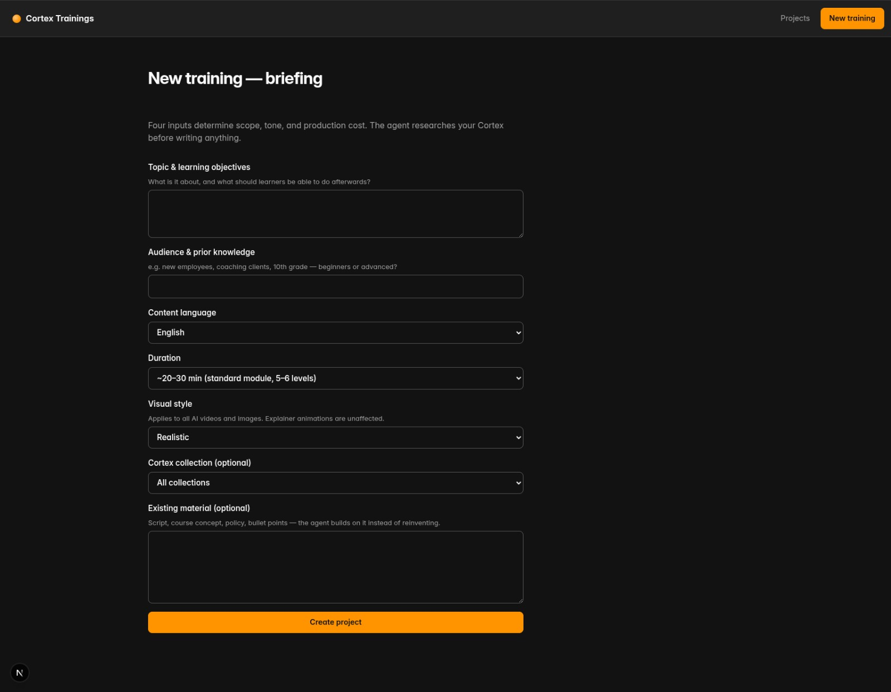
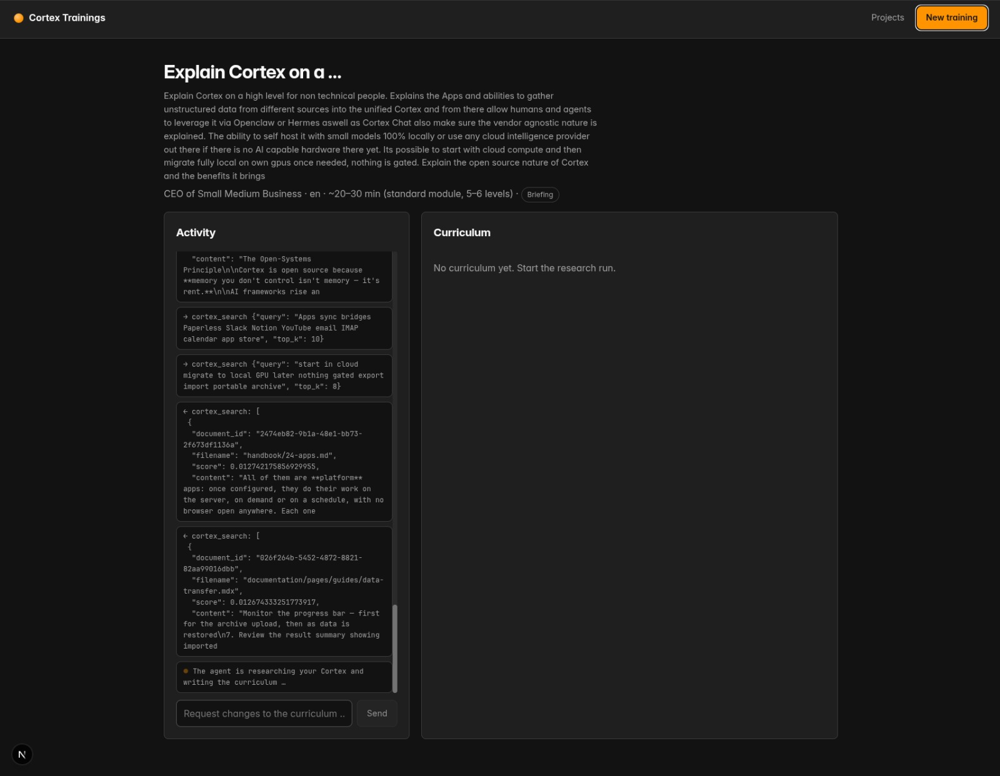
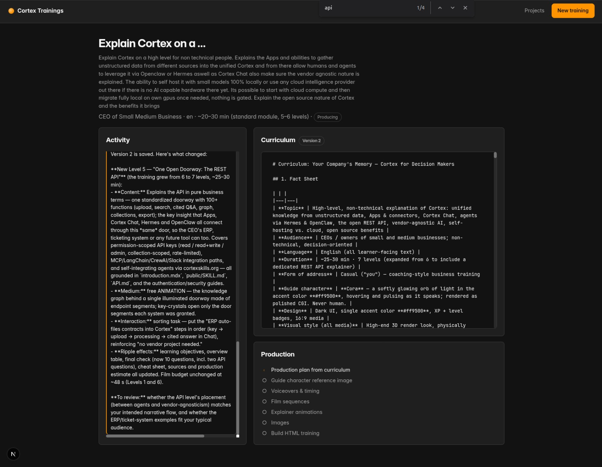
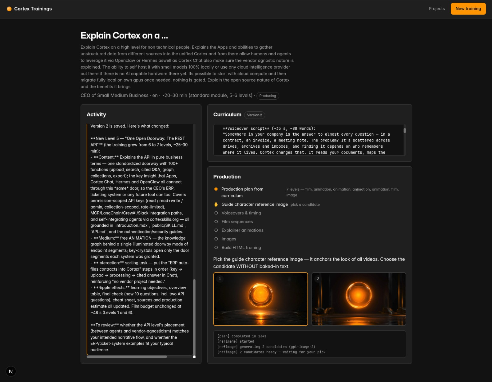
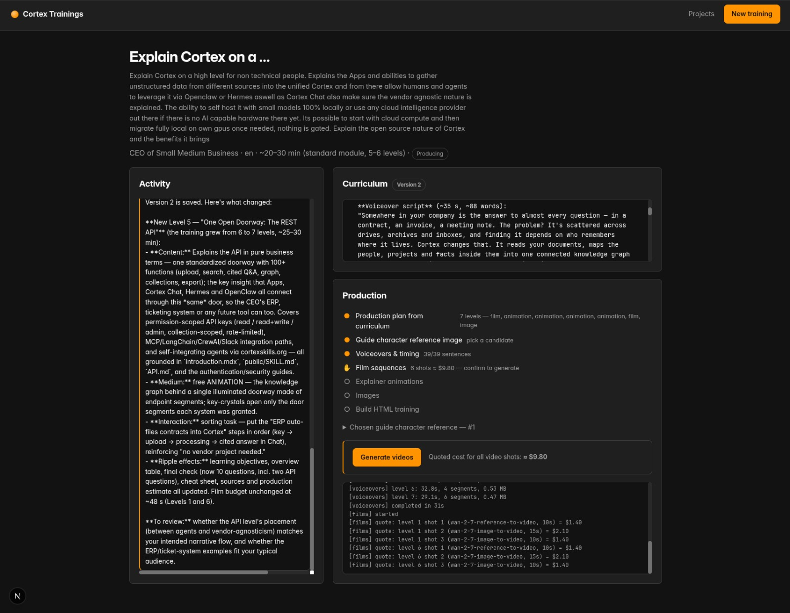
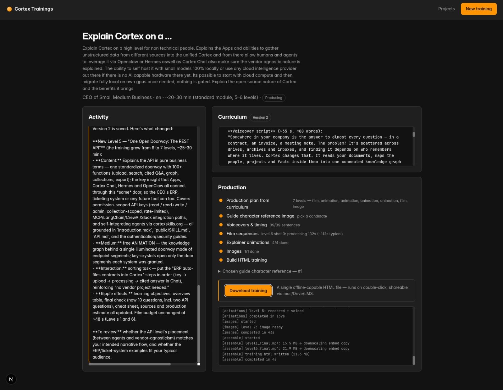

# Cortex Trainings

Standalone web application that turns domain knowledge from a [Cortex](https://docs.cortex.eco)
instance into interactive, offline-capable HTML training units, with
[Venice.ai](https://docs.venice.ai) as the AI provider.

**▶ [Try a training it produced](https://cortex.eco/demo/cortex-trainings.html)** — a real
7-level course about Cortex itself, generated from a Cortex instance. One HTML file, runs offline.

- **Documentation:** [`docs/`](docs/) — start with [docs/README.md](docs/README.md)
- **Original service analysis:** `OVERVIEW.md`
- **Repo guide for Claude Code:** `CLAUDE.md`

## How it works

```
Briefing ─▶ fable agent ──▶ curriculum.md ──▶ ⛔ approval ──▶ production ──▶ training.html
 4 inputs   deep research    versioned,        gate           7 steps       single file,
             over Cortex     reviewable                       resumable     runs offline
             (cheap)                                          (costs money)
```

Part 1 is free, so content gets finished and signed off as a document before any media is
generated. Part 2 pauses twice for human judgement: picking the guide-character reference
image, and confirming the live video cost quote. See [docs/workflow.md](docs/workflow.md).

## The flow, screen by screen

**1. Briefing** — four inputs the app refuses to guess (topic, audience, language, duration),
plus the visual style for all generated media and an optional collection to scope research to.
Optionally, upload up to 3 images of **your own guide character** and up to 3 **style
references**: a vision model extracts both into prompt text, your character then appears
across all films and images (rendered from the actual uploads, keeping its own colors), and
everything is generated in the referenced aesthetic instead of the preset style.



**2. Research** — the agent fans out deep-research and search calls across the knowledge base
before it writes a word. Every tool call and result is visible as it happens.



**3. Curriculum** — a complete document you can actually review: fact sheet, levels, scripts,
interactions, cited sources. Revisions are free and versioned; the agent explains what changed.



**4. Guide character** — production's first pause. Two candidates; you pick the one without
baked-in text, because this image anchors the look of every video.



**5. Cost gate** — every shot is quoted before a cent is spent, and nothing generates until you
confirm. Voiceovers are already done by this point (cents); video is the real expense.



**6. Done** — a single offline HTML file. The step list doubles as the audit trail, and the log
shows exactly what was produced and downscaled.



The result of this exact run is live:
**[cortex.eco/demo/cortex-trainings.html](https://cortex.eco/demo/cortex-trainings.html)**.

## Setup

```bash
cp .env.example .env    # VENICE_API_KEY, CORTEX_BASE_URL, CORTEX_API_KEY
npm install
npx playwright install chromium
npm run dev             # → http://localhost:3000
```

Requirements: Node 22+, ffmpeg and ffprobe on PATH, Playwright Chromium. The Cortex key must
be a plain read-only key (`cortex_ro_…`), ideally collection-scoped, and the instance needs
`ENABLE_AGENTIC_RAG` + `ENABLE_AGENT_RESEARCH` for deep research.

Full reference: [docs/configuration.md](docs/configuration.md).

## Layout

```
apps/web         Next.js app — UI, API routes, agent loop, production pipeline
apps/worker      placeholder for extracting production into its own process
packages/shared  Cortex + Venice clients, plan/state types
scripts/         qa-training.mjs — automated browser QA of a produced training
docs/            architecture, pipeline, provider notes, troubleshooting
```

## Commands

```bash
npm run dev                                  # dev server
npm run build                                # typecheck + production build
npm run typecheck                            # all workspaces
node scripts/qa-training.mjs <project-id>    # click through a produced training
```

## Data

Everything lives on disk under `STORAGE_PATH` (default `apps/web/data`) — project metadata,
every curriculum version, the production plan, per-step state, and all media. No database:
the artefacts are the point, so they stay diffable, recoverable, and inspectable. Layout in
[docs/architecture.md](docs/architecture.md#state-on-disk).

## Credits

The idea for this comes from **Julian Ivanov**. His
[video](https://youtu.be/gz0PBC2P9eg) demonstrated the approach — building a complete
interactive learning unit as a single offline HTML file, with the curriculum written and
approved before any expensive media is generated — and the skill itself lives in his
[KI-Automatisierungs-Community](https://hub.ki-automatisierungs-community.de/).

This repository is an independent implementation of that idea as a web application sourcing its
content from a knowledge base. It is not a copy of his skill and uses a different toolchain, so
the skill is linked rather than vendored — go to the source for the original. Thanks, Julian.
